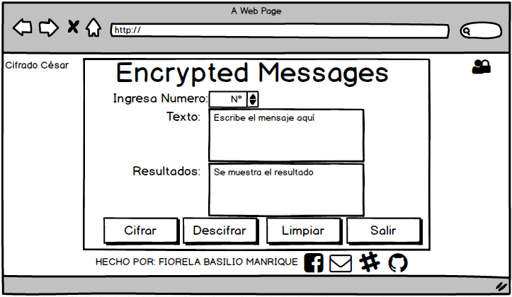

# Encrypted Messages

## Definición:

Este programa les va a servir para que sus mensajes sean privados y tengan mayor seguridad al momento de enviar y recibir el texto correspondiente, así sus mensajes privados no salgan a la luz. 

## Imagen Final

## Investigación UX

Los Usuarios que van acceder al programa “Encrypted Messages” van a poder tener sus mensajes de una manera segura y sin que sus mensajes sean vulnerados o sufra un robo de dicha información es por eso que **“Encrypted Messages”** da la mayor seguridad.

Es así que los usuarios que van enviar sus mensajes importantes, lo van hacer de una manera segura y eficaz, ya no tendrán el problema que sus mensajes enviados por correo electrónico, Messenger,etc lo vea otras personas o ser víctimas de hackers.

Al momento de usar el programa sus mensajes van a ser cifrados y va ser difícil de entenderlo, así se evitará que su información sea vulnerada es por eso que el programa “Encrypted Messages” da la mayor seguridad y confidencialidad al texto o mensaje que desea cifrar y al momento enviar al receptor.

## Prototipo en Papel
  1.	Primero el usuario tiene que acceder con una contraseña única que es LABORATORIA.
      - Si es que escribe tres veces la contraseña incorrecta le va salir un mensaje **“Ya utilizaste todos tus intentos no podrás Cifrar ni Descifrar mensajes”**.

  2.	Si pone la contraseña correcta puede acceder al siguiente formulario para que pueda cifrar y descifrar sus mensajes de una manera segura, también contara con un **botón limpiar** para que pueda escribir otros mensajes para ser cifrados o también descifrarlos y por ultimo cuenta también un **botón para salir del formulario** y vuelva a la página inicio para mayor seguridad.

## Resumen Feedback
  Los consejos recibidos por mis compañeras y mi usuario fueron muy buenos porque así pude mejorar en el diseño de mi programa había cosas que aún me faltaba para mejorar como agregarle más estilos a mi página de inicio, poner a mi formulario en el texto y en resultado un **textarea** ya que los mensajes pueden ser largos y asi pueda salir el texto completo para cifrarlos y descifrarlos gracias a sus opiniones pude mejorar mi programa.

## Prototipo en Balsamiq

